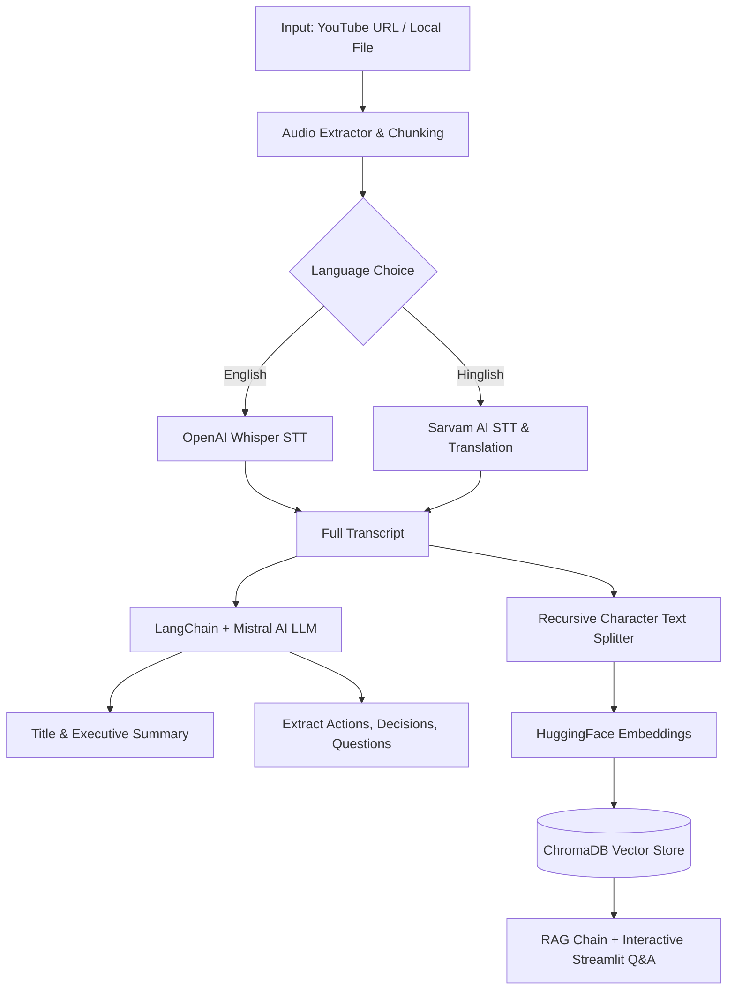

# 🎬 AI Video Assistant — Meeting Intelligence & RAG System

[](https://streamlit.io/)
[](https://www.langchain.com/)
[](https://github.com/openai/whisper)
[](https://mistral.ai/)
[](https://www.trychroma.com/)
[](https://www.docker.com/)

An end-to-end AI Video & Meeting Assistant built with **LangChain**, **OpenAI Whisper**, **Mistral AI**, and **ChromaDB**. Transform long YouTube videos or local meeting recordings into structured executive summaries, actionable insights, key decisions, and an interactive **RAG Q&A session**.

---

## ⚡ Features

- **📥 Dual Input Processing**: Accepts any YouTube URL or local audio/video file formats (`.mp4`, `.mp3`, `.wav`, `.webm`, `.m4a`).
- **🎙️ Advanced Speech-to-Text**:
  - **English**: High-accuracy local transcription powered by **OpenAI Whisper** (`small` model).
  - **Hinglish**: Integrated with **Sarvam AI** sync STT-Translate API for Hindi & English mixed speech.
- **📋 Executive Summarization & Title Generation**: Automatically synthesizes concise bulleted meeting summaries and short professional session titles.
- **🔍 Automated Insights Extraction**:
  - **✅ Action Items**: Task description, responsible owner, and deadline.
  - **🔑 Key Decisions**: Core resolutions made during the meeting.
  - **❓ Open Questions**: Unresolved topics and follow-up points.
- **🧠 Interactive RAG Chat**: Vectorize transcript chunks into **ChromaDB** using **HuggingFace Embeddings (`all-MiniLM-L6-v2`)** and chat with your video content in real-time.
- **🎨 Glassmorphism UI**: High-end Streamlit web interface with dynamic metric counters, dark theme aesthetic, tabbed navigation, and quick question suggestion pills.

---

## 🏗️ Architecture Flow



---

## 📁 Repository Structure

```text
├── core/
│   ├── transcriber.py       # Whisper & Sarvam AI STT engines
│   ├── summarizer.py        # Executive summary & title generation
│   ├── extractor.py         # Action items, key decisions & questions extraction
│   ├── vector_store.py      # ChromaDB vector index & embeddings setup
│   └── rag_engine.py        # LangChain LCEL RAG QA pipeline
├── utils/
│   └── audio_processor.py   # yt-dlp downloader, static-ffmpeg & audio chunking
├── app.py                   # Streamlit Web Application Dashboard
├── main.py                  # CLI Entry Point
├── Dockerfile               # Production Docker container configuration
├── packages.txt             # Linux system dependencies (ffmpeg)
├── requirements.txt         # Python dependencies
└── README.md
```

---

## 🚀 Quickstart & Local Setup

### 1. Prerequisites
- **Python 3.10 to 3.13** installed.
- Git installed.

### 2. Clone Repository & Setup Virtual Environment

```bash
git clone https://github.com/abishekak18/Video-Assistant-RAG.git
cd Video-Assistant-RAG

python -m venv venv
```

Activate the environment:
- **Windows (PowerShell)**: `.\venv\Scripts\Activate.ps1`
- **Command Prompt**: `venv\Scripts\activate.bat`
- **Linux / macOS**: `source venv/bin/activate`

### 3. Install Dependencies

```bash
pip install -r requirements.txt
```

> **Note**: `static-ffmpeg` automatically downloads and configures portable `ffmpeg` and `ffprobe` binaries for audio conversion!

### 4. Configure Environment Variables

Create a `.env` file in the root directory:

```env
MISTRAL_API_KEY=your_mistral_api_key_here
SARVAM_API_KEY=your_sarvam_api_key_here   # Optional (required only for Hinglish speech)
WHISPER_MODEL=small                        # Optional (tiny, base, small, medium, large)
```

---

## 💻 Running the Application

### 🌐 Option A: Streamlit Web UI (Recommended)

Launch the interactive web application:

```bash
streamlit run app.py
```

Open your browser at `http://localhost:8501`.

### 🖥️ Option B: Command Line Interface (CLI)

Run the CLI pipeline directly in your terminal:

```bash
python main.py
```

---

## 🐳 Docker Deployment

Build and run using Docker:

```bash
# Build Docker image
docker build -t video-assistant-rag .

# Run container with environment file
docker run -p 8501:8501 --env-file .env video-assistant-rag
```

Access the app at `http://localhost:8501`.

---

## ☁️ Cloud Deployment Options

### Streamlit Community Cloud (Free)
1. Push your code to GitHub repository `abishekak18/Video-Assistant-RAG`.
2. Go to **[share.streamlit.io](https://share.streamlit.io/)** and create a new app.
3. Add secrets (`MISTRAL_API_KEY`, `SARVAM_API_KEY`) under **App Settings -> Secrets**.
4. Deploy with 1 click!
